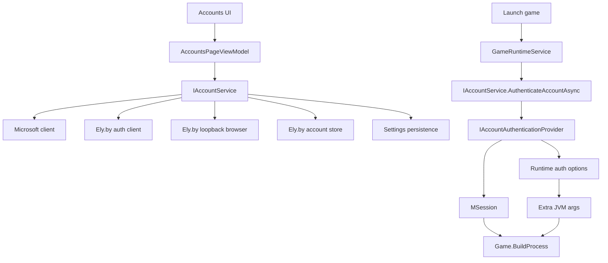

# Emerald Login Flow Book

This document is a tour of the `noobnotfound/authentication` branch as compared with `main`.
It focuses on the account and login flow: Microsoft, Ely.by OAuth, offline accounts, cancellation,
selection, persistence, launch-time authentication, and authlib-injector wiring.

The intent is to be a readable book for future work, not a terse PR summary.

## Table Of Contents

1. Branch verdict
2. What changed compared to `main`
3. Big mental model
4. File map
5. UI flow from button click to command
6. ViewModel login state, cancellation, and navigation persistence
7. CoreX account service layout
8. Microsoft sign-in flow
9. Ely.by OAuth sign-in flow
10. Ely.by loopback browser callback flow
11. Ely.by token exchange and account info flow
12. Account storage and loading
13. Launch-time authentication
14. How authlib-injector enters the Minecraft process
15. Removal and sign-out
16. Tests added by the branch
17. Future provider checklist
18. Risks and follow-up notes

## 1. Branch Verdict

This branch is a real account architecture refactor, not just an Ely.by patch.

The useful part is that authentication is now split into provider-shaped pieces:

- Microsoft provider
- Offline provider
- Ely.by provider
- shared account service orchestration
- provider-specific storage and token handling
- launch-time runtime auth options

That is the right direction for supporting more auth systems later. `AccountService` still owns account
selection, persistence, and user-facing orchestration, but the provider-specific auth details are no longer
stuffed directly into one huge class.

The two biggest product changes are:

- Ely.by browser OAuth is supported.
- Microsoft and Ely.by sign-in can be canceled from the UI, and the in-progress login is no longer lost when navigating away from the Accounts page.

The biggest risk is secret handling: Ely.by `client_secret` currently lives in `App.xaml.cs`. That works for now,
but it is not ideal for source control or public distribution.

## 2. What Changed Compared To `main`

Branch:

```text
noobnotfound/authentication
```

Commits ahead of `main`:

```text
2e54926 Add Ely.by account support and auth providers
b1ac52c Temporary disable MS requirement
f302192 Add Ely.by OAuth browser sign-in & refresh
9455941 Support cancelable account sign-in flows
```

High-level diff:

```text
40 files changed
2528 insertions
574 deletions
```

Main categories:

- `AccountService` was split into partial files.
- Account authentication now uses `IAccountAuthenticationProvider`.
- `EAccount` now has `AccountType.ElyBy` and `ProviderId`.
- Ely.by account storage was added under `SettingsKeys.ElyByAccounts`.
- Ely.by OAuth token exchange, refresh, and account info calls were added.
- Browser loopback OAuth callback handling was added in the Uno app layer.
- authlib-injector download and JVM argument injection were added.
- `GameAuthenticationResult` now carries both a CmlLib `MSession` and runtime auth options.
- The Accounts page now has a cancel login button.
- `AccountsPageViewModel` is singleton-scoped so login state survives navigation away/back.

## 3. Big Mental Model

There are two phases:

1. Account sign-in
2. Game launch authentication

Sign-in is when the account is added to Emerald.
Launch authentication is when Emerald turns a selected stored account into a CmlLib `MSession` and, for Ely.by,
adds authlib-injector JVM arguments.



The core abstraction is:

```csharp
public interface IAccountAuthenticationProvider
{
    AccountType AccountType { get; }
    string ProviderId { get; }
    Task<GameAuthenticationResult> AuthenticateAsync(EAccount account, CancellationToken cancellationToken = default);
    Task RemoveAsync(EAccount account, CancellationToken cancellationToken = default);
}
```

Line by line:

- `public interface IAccountAuthenticationProvider`: defines a provider contract for a kind of account.
- `AccountType AccountType`: tells `AccountService` which `EAccount.Type` this provider handles.
- `string ProviderId`: gives a stable string identity such as `microsoft`, `offline`, or `elyby`.
- `AuthenticateAsync(...)`: turns a stored/listed Emerald account into launch credentials.
- `RemoveAsync(...)`: lets the provider perform provider-specific cleanup when removing an account.

## 4. File Map

### Uno App Layer

| File | Role |
| --- | --- |
| `Emerald/App.xaml.cs` | DI composition root. Registers Ely OAuth options, Ely client, Ely browser, authlib-injector, account service, viewmodels. |
| `Emerald/Views/AccountsPage.xaml` | Accounts UI. Buttons for Microsoft, Ely.by, offline, cancel login, account list. |
| `Emerald/Views/AccountsPage.xaml.cs` | Page glue. Creates offline dialog and forwards account remove/select clicks to the viewmodel. |
| `Emerald/ViewModels/AccountsPageViewModel.cs` | UI state and commands for account loading, sign-in, cancellation, removal, selection. |
| `Emerald/Services/ElyByLoopbackOAuthBrowser.cs` | App/platform-specific browser OAuth implementation using `HttpListener` and `Launcher.LaunchUriAsync`. |

### CoreX Layer

| File | Role |
| --- | --- |
| `Emerald.CoreX/Services/IAccountService.cs` | Public account service contract used by UI/runtime. |
| `Emerald.CoreX/Services/AccountService.cs` | Constructor, fields, initialization, provider registration. |
| `Emerald.CoreX/Services/AccountService.SignIn.cs` | Offline creation, Microsoft sign-in, Ely.by sign-in. |
| `Emerald.CoreX/Services/AccountService.Loading.cs` | Loads offline, Microsoft, and Ely.by accounts into the observable account list. |
| `Emerald.CoreX/Services/AccountService.Authentication.cs` | Authenticates selected accounts for launch and removes accounts. |
| `Emerald.CoreX/Services/AccountService.Selection.cs` | Selection state and account policy enforcement. |
| `Emerald.CoreX/Services/AccountService.Persistence.cs` | Persists visible account list and selected account id. |
| `Emerald.CoreX/Services/Auth/*` | Provider contracts, provider IDs, runtime auth options, auth provider implementations. |
| `Emerald.CoreX/Services/Auth/ElyBy/*` | Ely.by OAuth/direct auth, account store, stored model, browser contract. |
| `Emerald.CoreX/Services/Auth/Authlib/*` | authlib-injector download and JVM arg creation. |

### Runtime Layer

| File | Role |
| --- | --- |
| `Emerald.CoreX/Runtime/GameRuntimeService.cs` | Calls account authentication before building a Minecraft process. |
| `Emerald.CoreX/Game.cs` | Receives session and extra JVM args, builds CmlLib launch options. |

## 5. UI Flow From Button Click To Command

The Accounts toolbar is in `Emerald/Views/AccountsPage.xaml`.

Core snippet:

```xml
<AppBarButton
  Command="{x:Bind ViewModel.AddMicrosoftAccountCommand}"
  Icon="Contact"
  Label="{helpers:Localize KeyName=SignInWithMS}"
  IsEnabled="{x:Bind ViewModel.CanStartMicrosoftLogin, Mode=OneWay}"/>

<AppBarButton
  Command="{x:Bind ViewModel.AddElyByAccountCommand}"
  Icon="World"
  Label="{helpers:Localize KeyName=SignInWithElyBy}"
  IsEnabled="{x:Bind ViewModel.CanStartElyByLogin, Mode=OneWay}"/>

<AppBarButton
  Command="{x:Bind ViewModel.CancelLoginCommand}"
  Icon="Cancel"
  Label="{helpers:Localize KeyName=CancelLogin}"
  Visibility="{x:Bind ViewModel.IsLoginInProgress, Mode=OneWay, Converter={StaticResource BoolToVis}}"/>
```

Line by line:

- `Command="{x:Bind ViewModel.AddMicrosoftAccountCommand}"`: binds the Microsoft button to the relay command generated from `AddMicrosoftAccountAsync`.
- `Icon="Contact"`: uses a built-in app bar icon.
- `Label="{helpers:Localize KeyName=SignInWithMS}"`: gets the button text from resources.
- `IsEnabled="{x:Bind ViewModel.CanStartMicrosoftLogin, Mode=OneWay}"`: disables Microsoft login while another login is running.
- `Command="{x:Bind ViewModel.AddElyByAccountCommand}"`: binds the Ely.by button to the generated Ely command.
- `Icon="World"`: visual hint for an external/online provider.
- `Label="{helpers:Localize KeyName=SignInWithElyBy}"`: localized Ely button label.
- `IsEnabled="{x:Bind ViewModel.CanStartElyByLogin, Mode=OneWay}"`: disables Ely if policy disallows it or another login is active.
- `Command="{x:Bind ViewModel.CancelLoginCommand}"`: binds Cancel to the generated cancellation command.
- `Icon="Cancel"`: standard cancel icon.
- `Label="{helpers:Localize KeyName=CancelLogin}"`: localized cancel label.
- `Visibility="{x:Bind ViewModel.IsLoginInProgress ...}"`: the cancel button only appears while a login is in progress.

The loading panel repeats the cancel affordance:

```xml
<StackPanel
  Spacing="12"
  HorizontalAlignment="Center"
  Margin="0,48,0,0"
  Visibility="{x:Bind ViewModel.IsLoading, Mode=OneWay, Converter={StaticResource BoolToVis}}">
  <ProgressRing IsActive="True"/>
  <TextBlock Text="{x:Bind ViewModel.LoadingMessage, Mode=OneWay}" TextAlignment="Center"/>
  <Button
    HorizontalAlignment="Center"
    Command="{x:Bind ViewModel.CancelLoginCommand}"
    Content="{helpers:Localize KeyName=CancelLogin}"
    Visibility="{x:Bind ViewModel.IsLoginInProgress, Mode=OneWay, Converter={StaticResource BoolToVis}}"/>
</StackPanel>
```

Line by line:

- `Visibility="{x:Bind ViewModel.IsLoading ...}"`: panel appears during account load or active sign-in.
- `ProgressRing IsActive="True"`: shows indeterminate progress.
- `TextBlock Text="{x:Bind ViewModel.LoadingMessage ...}"`: displays either `Loading accounts...` or provider-specific login status.
- `Button Command="{x:Bind ViewModel.CancelLoginCommand}"`: gives the user a second obvious cancel target in the center of the page.
- `Content="{helpers:Localize KeyName=CancelLogin}"`: localizes the button text.
- `Visibility="{x:Bind ViewModel.IsLoginInProgress ...}"`: hides the cancel button for normal account loading.

## 6. ViewModel Login State, Cancellation, And Navigation Persistence

The viewmodel is registered as a singleton:

```csharp
services.AddSingleton<ViewModels.AccountsPageViewModel>();
```

Why this matters:

- Before this, navigating away from Accounts and back could create a new viewmodel.
- A new viewmodel would not know about the running login task.
- Now the viewmodel instance lives for the app lifetime.
- Its `IsLoginInProgress`, cancellation source, and loading message survive page recreation.

### Fields And Observable State

Snippet:

```csharp
private readonly IAccountService _accountService;
private readonly INotificationService _notificationService;
private readonly ILogger<AccountsPageViewModel> _logger;
private CancellationTokenSource? _loginCancellationSource;

[ObservableProperty]
[NotifyPropertyChangedFor(nameof(LoadingMessage))]
private bool _isLoading;

[ObservableProperty]
[NotifyPropertyChangedFor(nameof(LoadingMessage))]
[NotifyPropertyChangedFor(nameof(CanStartMicrosoftLogin))]
[NotifyPropertyChangedFor(nameof(CanStartElyByLogin))]
[NotifyPropertyChangedFor(nameof(CanStartOfflineAccount))]
[NotifyPropertyChangedFor(nameof(CanCancelLogin))]
[NotifyCanExecuteChangedFor(nameof(AddMicrosoftAccountCommand))]
[NotifyCanExecuteChangedFor(nameof(AddElyByAccountCommand))]
[NotifyCanExecuteChangedFor(nameof(AddOfflineAccountCommand))]
[NotifyCanExecuteChangedFor(nameof(CancelLoginCommand))]
private bool _isLoginInProgress;
```

Line by line:

- `_accountService`: the CoreX service that owns account operations.
- `_notificationService`: the app notification surface for success, warnings, and errors.
- `_logger`: diagnostic logging for failures and cancellation.
- `_loginCancellationSource`: the active login cancellation source. `null` means no login is active.
- `[ObservableProperty]` on `_isLoading`: CommunityToolkit generates `IsLoading` and change notifications.
- `[NotifyPropertyChangedFor(nameof(LoadingMessage))]`: whenever `IsLoading` changes, also notify that `LoadingMessage` may need to refresh.
- `[ObservableProperty]` on `_isLoginInProgress`: generates `IsLoginInProgress`.
- Notify lines for `CanStart...`: the UI enablement properties depend on login state.
- Notify lines for commands: command `CanExecute` needs to be recalculated when login state changes.

### Gate Properties

Snippet:

```csharp
public bool CanStartMicrosoftLogin => !IsLoginInProgress;
public bool CanStartElyByLogin => CanCreateElyByAccount && !IsLoginInProgress;
public bool CanStartOfflineAccount => CanCreateOfflineAccount && !IsLoginInProgress;
public bool CanCancelLogin
    => IsLoginInProgress && _loginCancellationSource is { IsCancellationRequested: false };
public string LoadingMessage => IsLoginInProgress ? LoginStatusMessage : "Loading accounts...";
```

Line by line:

- `CanStartMicrosoftLogin`: Microsoft login is allowed only when no login is already active.
- `CanStartElyByLogin`: Ely login also checks the Ely policy gate.
- `CanStartOfflineAccount`: offline account creation also waits for active login to finish.
- `CanCancelLogin`: true only while there is an active, uncanceled cancellation source.
- `LoadingMessage`: provider-specific message during login, generic message during normal loading.

### Microsoft Command

Snippet:

```csharp
[RelayCommand(CanExecute = nameof(CanStartMicrosoftLogin))]
private async Task AddMicrosoftAccountAsync()
{
    var cancellationToken = BeginLogin("Complete Microsoft sign-in in your browser.");
    try
    {
        await _accountService.SignInMicrosoftAccountAsync(cancellationToken);
        _notificationService.Info("AccountAdded", "Microsoft account added successfully!");
        NotifyAccountStateChanged();
    }
    catch (OperationCanceledException) when (cancellationToken.IsCancellationRequested)
    {
        _logger.LogInformation("Microsoft sign-in was canceled.");
        LoadErrorMessage = null;
        _notificationService.Info("SignInCanceled", "Microsoft sign-in canceled.");
    }
    catch (Exception ex)
    {
        _logger.LogError(ex, "Failed to sign in with Microsoft account.");
        LoadErrorMessage = "Failed to add Microsoft account.";
        _notificationService.Error("SignInError", "Failed to add Microsoft account.", ex: ex);
    }
    finally
    {
        EndLogin(cancellationToken);
    }
}
```

Line by line:

- `[RelayCommand(...)]`: CommunityToolkit generates `AddMicrosoftAccountCommand`.
- `CanExecute = nameof(CanStartMicrosoftLogin)`: command disables itself when a login is active.
- `BeginLogin(...)`: creates the cancellation token and flips UI into login mode.
- `try`: all sign-in outcomes are handled in one place.
- `_accountService.SignInMicrosoftAccountAsync(cancellationToken)`: delegates actual Microsoft auth to CoreX.
- Success notification: tells the user the account was added.
- `NotifyAccountStateChanged()`: refreshes selected account and account creation gate properties.
- `catch (OperationCanceledException) when (...)`: treats user cancellation as normal, not as an error.
- Log line: records cancellation for diagnostics.
- `LoadErrorMessage = null`: cancellation should not leave an error banner.
- cancellation info notification: tells the user the cancel button worked.
- generic `catch`: real failures are logged and surfaced as errors.
- `finally`: always clears the login UI state if this is still the active token.

### Ely.by Command

Snippet:

```csharp
[RelayCommand(CanExecute = nameof(CanStartElyByLogin))]
private async Task AddElyByAccountAsync()
{
    if (!CanCreateElyByAccount)
    {
        _notificationService.Warning("ElyByNeedsMicrosoft", "Sign in with a Microsoft account before adding Ely.by accounts.");
        return;
    }

    var cancellationToken = BeginLogin("Complete Ely.by sign-in in your browser.");
    try
    {
        _notificationService.Info("UsingBrowser", "Complete Ely.by sign-in in your browser.");
        await _accountService.SignInElyByAccountAsync(cancellationToken);
        _notificationService.Info("AccountAdded", "Ely.by account added successfully!");
        NotifyAccountStateChanged();
    }
    catch (OperationCanceledException) when (cancellationToken.IsCancellationRequested)
    {
        _logger.LogInformation("Ely.by sign-in was canceled.");
        LoadErrorMessage = null;
        _notificationService.Info("SignInCanceled", "Ely.by sign-in canceled.");
    }
    catch (Exception ex)
    {
        _logger.LogError(ex, "Failed to sign in with Ely.by account.");
        LoadErrorMessage = "Failed to add Ely.by account.";
        _notificationService.Error("ElyBySignInError", "Failed to add Ely.by account.", ex: ex);
    }
    finally
    {
        EndLogin(cancellationToken);
    }
}
```

Line by line:

- `[RelayCommand(CanExecute = nameof(CanStartElyByLogin))]`: generates `AddElyByAccountCommand`.
- `if (!CanCreateElyByAccount)`: defensive policy check. Currently policy is disabled, but the guard remains.
- warning notification: explains what would be needed if policy is enabled later.
- `BeginLogin(...)`: starts persistent/cancelable login state.
- browser info notification: tells user to look at the browser.
- `_accountService.SignInElyByAccountAsync(cancellationToken)`: calls CoreX Ely OAuth flow.
- success notification: confirms stored account was created.
- cancellation catch: handles cancel cleanly.
- generic catch: real Ely failures become error notifications.
- `finally`: guarantees UI cleanup.

### Cancel Command

Snippet:

```csharp
[RelayCommand(CanExecute = nameof(CanCancelLogin))]
private void CancelLogin()
{
    if (_loginCancellationSource is not { IsCancellationRequested: false })
    {
        return;
    }

    LoginStatusMessage = "Canceling sign-in...";
    _loginCancellationSource.Cancel();
    NotifyLoginCommandStateChanged();
}
```

Line by line:

- `[RelayCommand(CanExecute = nameof(CanCancelLogin))]`: generates a command that is enabled only during cancelable login.
- `if (...) return`: avoids double-cancel and null cases.
- `LoginStatusMessage = "Canceling sign-in..."`: immediately updates the UI status text.
- `_loginCancellationSource.Cancel()`: signals cancellation to Microsoft or Ely code.
- `NotifyLoginCommandStateChanged()`: disables Cancel after it has been clicked.

### Begin And End Login

Snippet:

```csharp
private CancellationToken BeginLogin(string statusMessage)
{
    _loginCancellationSource?.Dispose();
    _loginCancellationSource = new CancellationTokenSource();
    LoginStatusMessage = statusMessage;
    LoadErrorMessage = null;
    IsLoginInProgress = true;
    IsLoading = true;
    NotifyAccountStateChanged();
    NotifyLoginCommandStateChanged();
    return _loginCancellationSource.Token;
}
```

Line by line:

- Dispose old cancellation source if one somehow exists.
- Create a new cancellation source for this specific login.
- Set the text the loading panel shows.
- Clear old load/sign-in error text.
- Mark login as active.
- Mark page as loading so the spinner/panel appears.
- Notify dependent account properties.
- Notify command enablement.
- Return the token that will be passed through the whole auth stack.

Snippet:

```csharp
private void EndLogin(CancellationToken cancellationToken)
{
    if (_loginCancellationSource is null || !_loginCancellationSource.Token.Equals(cancellationToken))
    {
        return;
    }

    _loginCancellationSource.Dispose();
    _loginCancellationSource = null;
    IsLoginInProgress = false;
    LoginStatusMessage = "Loading accounts...";
    IsLoading = false;
    NotifyAccountStateChanged();
    NotifyLoginCommandStateChanged();
}
```

Line by line:

- Checks this completion belongs to the active login.
- If a newer login ever exists, the old one cannot clear the new state.
- Dispose the source.
- Clear the active source.
- Mark login inactive.
- Reset loading message.
- Hide loading spinner/panel.
- Refresh dependent account state.
- Refresh command enabled/disabled state.

## 7. CoreX Account Service Layout

`AccountService` is now a partial class. The split is mostly organizational:

- `AccountService.cs`: fields, constructor, DI fallback defaults, initialization.
- `AccountService.SignIn.cs`: sign-in and account creation.
- `AccountService.Loading.cs`: load account list from stores.
- `AccountService.Authentication.cs`: authenticate/remove account.
- `AccountService.Selection.cs`: selected account state.
- `AccountService.Persistence.cs`: settings persistence.

### Constructor And Provider Registration

Snippet:

```csharp
internal AccountService(
    ILogger<AccountService> logger,
    IBaseSettingsService settingsService,
    IUiDispatcher uiDispatcher,
    string? accountStorePath = null,
    IMicrosoftAccountClient? microsoftAccountClient = null,
    INotificationService? notificationService = null,
    IElyByAuthClient? elyByAuthClient = null,
    IElyByAccountStore? elyByAccountStore = null,
    IElyByOAuthBrowser? elyByOAuthBrowser = null,
    IAuthlibInjectorService? authlibInjectorService = null,
    IEnumerable<IAccountAuthenticationProvider>? authenticationProviders = null)
```

Line by line:

- `ILogger<AccountService>`: logs account operations.
- `IBaseSettingsService`: JSON-backed settings store.
- `IUiDispatcher`: ensures observable collection mutations happen on the UI thread.
- `accountStorePath`: CmlLib Microsoft account cache path.
- `IMicrosoftAccountClient?`: optional injected Microsoft client for tests or app DI.
- `INotificationService?`: optional notifications for account loading warnings.
- `IElyByAuthClient?`: optional injected Ely client.
- `IElyByAccountStore?`: optional Ely persistence abstraction.
- `IElyByOAuthBrowser?`: optional app-specific browser OAuth implementation.
- `IAuthlibInjectorService?`: optional authlib-injector service.
- `authenticationProviders`: optional fully custom providers for tests/future wiring.

Provider defaults:

```csharp
return
[
    new OfflineAccountAuthenticationProvider(),
    new MicrosoftAccountAuthenticationProvider(_microsoftAccountClient),
    new ElyByAccountAuthenticationProvider(_elyByAccountStore, _elyByAuthClient, authlib)
];
```

Line by line:

- Offline provider is stateless and returns an offline session.
- Microsoft provider wraps `IMicrosoftAccountClient`.
- Ely provider needs Ely account storage, Ely token client, and authlib-injector.

## 8. Microsoft Sign-In Flow

The Microsoft flow still relies on CmlLib and XboxAuthNet MSAL.

### App Startup Initialization

`App.xaml.cs` has:

```csharp
private const string MicrosoftClientId = "...";
```

Then during launch:

```csharp
var ac = Ioc.Default.GetService<CoreX.Services.IAccountService>();
_ = ac.InitializeAsync(MicrosoftClientId);
```

Meaning:

- The app gets `IAccountService` from DI.
- It starts Microsoft auth initialization in the background.
- `AccountService.InitializeAsync(...)` delegates to `IMicrosoftAccountClient.InitializeAsync(...)`.

### CmlLib Microsoft Client Setup

Snippet:

```csharp
var app = await MsalClientHelper.BuildApplicationWithCache(clientId).ConfigureAwait(false);
_loginHandler = new JELoginHandlerBuilder()
    .WithLogger(_logger)
    .WithOAuthProvider(new MsalCodeFlowProvider(app))
    .WithAccountManager(accountStorePath)
    .Build();
```

Line by line:

- `MsalClientHelper.BuildApplicationWithCache(clientId)`: builds an MSAL client with token cache support.
- `new JELoginHandlerBuilder()`: starts CmlLib Microsoft auth setup.
- `.WithLogger(_logger)`: routes auth logs into Emerald logging.
- `.WithOAuthProvider(new MsalCodeFlowProvider(app))`: tells CmlLib to use MSAL code flow.
- `.WithAccountManager(accountStorePath)`: persists Microsoft accounts in a CmlLib account file.
- `.Build()`: creates the `JELoginHandler`.

### Interactive Sign-In With Cancellation

Snippet:

```csharp
public async Task<MicrosoftInteractiveSignInResult> SignInInteractivelyAsync(CancellationToken cancellationToken = default)
{
    EnsureInitialized();
    cancellationToken.ThrowIfCancellationRequested();

    var interactiveTask = _loginHandler!.AuthenticateInteractively();
    MSession session;
    try
    {
        session = await interactiveTask.WaitAsync(cancellationToken).ConfigureAwait(false);
    }
    catch (OperationCanceledException) when (cancellationToken.IsCancellationRequested)
    {
        ObserveInteractiveSignInAfterCancellation(interactiveTask);
        throw;
    }

    cancellationToken.ThrowIfCancellationRequested();
    SaveAccounts();

    return new MicrosoftInteractiveSignInResult(
        Normalize(session.UUID),
        Normalize(session.Username),
        Normalize(session.UUID));
}
```

Line by line:

- Method returns a small normalized result instead of exposing all CmlLib details.
- `EnsureInitialized()`: fails early if `InitializeAsync` was not called.
- `ThrowIfCancellationRequested()`: handles cancel before opening/awaiting anything.
- `AuthenticateInteractively()`: starts CmlLib browser/MSAL login.
- `MSession session;`: will hold the authenticated Minecraft session.
- `try`: wraps the await so cancellation can be handled specially.
- `WaitAsync(cancellationToken)`: lets Emerald stop waiting when user clicks Cancel.
- cancellation catch: only handles user-requested cancellation.
- `ObserveInteractiveSignInAfterCancellation(...)`: prevents an abandoned task exception from being unobserved later.
- `throw`: keeps cancellation flowing to the viewmodel.
- second `ThrowIfCancellationRequested()`: if cancellation happens immediately after auth completes, do not persist.
- `SaveAccounts()`: writes CmlLib account cache.
- return result with identifier/name/uuid.

Important nuance:

Canceling Microsoft here means Emerald stops waiting and will not materialize the account. It cannot forcibly close
the external browser or cancel every internal MSAL/CmlLib operation once launched.

### AccountService Microsoft Materialization

Snippet:

```csharp
var beforeIdentifiers = _microsoftAccountClient
    .GetAccounts()
    .Select(account => account.Identifier)
    .Where(identifier => !string.IsNullOrWhiteSpace(identifier))
    .ToHashSet(StringComparer.Ordinal);

var signInResult = await _microsoftAccountClient.SignInInteractivelyAsync(cancellationToken).ConfigureAwait(false);

var afterAccounts = _microsoftAccountClient.GetAccounts();
await LoadAllAccountsAsync().ConfigureAwait(false);

var candidateIdentifiers = BuildMaterializationCandidates(
    signInResult,
    beforeIdentifiers,
    afterAccounts,
    _microsoftAccountClient.GetDefaultAccountIdentifier());
```

Line by line:

- Capture Microsoft account identifiers before sign-in.
- Start interactive sign-in.
- Read accounts after sign-in.
- Reload Emerald account list from CmlLib plus settings.
- Build a candidate identifier list to find which loaded account corresponds to the new sign-in.

Why candidate matching exists:

- CmlLib/MSAL can return different identifiers depending on account state.
- New account may be found by returned UUID, newly added account, default account, or most recent account.
- The branch tries those in order instead of assuming one field is always correct.

## 9. Ely.by OAuth Sign-In Flow

This is the central new flow.

### OAuth Options

Snippet:

```csharp
internal sealed record ElyByOAuthOptions(
    string ClientId,
    string ClientSecret,
    string RedirectUri,
    string Scope = ElyByOAuthOptions.DefaultScope)
{
    public const string DefaultScope = "account_info offline_access minecraft_server_session";

    public bool IsConfigured
        => !IsPlaceholder(ClientId)
           && !IsPlaceholder(ClientSecret)
           && Uri.TryCreate(RedirectUri, UriKind.Absolute, out _);
}
```

Line by line:

- `ElyByOAuthOptions`: immutable-ish record for Ely OAuth configuration.
- `ClientId`: Ely OAuth app client id.
- `ClientSecret`: Ely OAuth app client secret.
- `RedirectUri`: loopback callback URI.
- `Scope`: defaults to the scopes Emerald needs.
- `account_info`: lets Emerald fetch username/UUID.
- `offline_access`: lets Emerald receive refresh tokens.
- `minecraft_server_session`: makes the token suitable for Minecraft server session use.
- `IsConfigured`: prevents placeholder or invalid values from being used.

### App DI Registration

Snippet with secret redacted here intentionally:

```csharp
private const string ElyByClientId = "emerald1";
private const string ElyByClientSecret = "<redacted>";
private const string ElyByRedirectUri = "http://127.0.0.1:58135/oauth/elyby/";

services.AddSingleton<CoreX.Services.Auth.ElyBy.ElyByOAuthOptions>(_ =>
    new CoreX.Services.Auth.ElyBy.ElyByOAuthOptions(
        ElyByClientId,
        ElyByClientSecret,
        ElyByRedirectUri));
```

Line by line:

- Client id is defined at app composition level.
- Client secret is currently defined there too. This is functional but sensitive.
- Redirect URI is the local callback URI.
- DI registers `ElyByOAuthOptions` as singleton because config is app-wide.
- `ElyByAuthClient` receives these options through DI.

### AccountService Ely Sign-In

Snippet:

```csharp
public async Task SignInElyByAccountAsync(CancellationToken cancellationToken = default)
{
    EnsureElyByAccountPolicyMet("Signing in with Ely.by requires at least one Microsoft account.");
    cancellationToken.ThrowIfCancellationRequested();

    var state = CreateOAuthState();
    var authorizationRequest = _elyByAuthClient.CreateOAuthAuthorizationRequest(state);

    _logger.LogInformation("Starting Ely.by browser sign-in.");
    var authorizationResult = await _elyByOAuthBrowser
        .AuthorizeAsync(authorizationRequest, cancellationToken)
        .ConfigureAwait(false);
    var session = await _elyByAuthClient
        .ExchangeOAuthCodeAsync(authorizationResult.Code, cancellationToken)
        .ConfigureAwait(false);

    await AddOrUpdateElyBySessionAsync(session, cancellationToken).ConfigureAwait(false);
    _logger.LogInformation("Ely.by account '{Name}' signed in through OAuth.", session.Name);
}
```

Line by line:

- `EnsureElyByAccountPolicyMet(...)`: checks the Microsoft-required policy. Currently disabled, but still wired.
- `ThrowIfCancellationRequested()`: cancels before doing OAuth work.
- `CreateOAuthState()`: creates a random anti-CSRF state value.
- `CreateOAuthAuthorizationRequest(state)`: builds the Ely authorization URL and redirect metadata.
- log line: records that browser sign-in is starting.
- `_elyByOAuthBrowser.AuthorizeAsync(...)`: app-layer browser flow opens the browser and waits for callback.
- `authorizationResult.Code`: the OAuth authorization code from Ely.by.
- `_elyByAuthClient.ExchangeOAuthCodeAsync(...)`: trades the code for access/refresh token and account info.
- `AddOrUpdateElyBySessionAsync(...)`: persists the Ely account and updates the observable account list.
- final log: confirms success.

### OAuth State Generation

Snippet:

```csharp
private static string CreateOAuthState()
{
    Span<byte> bytes = stackalloc byte[32];
    RandomNumberGenerator.Fill(bytes);
    return Convert.ToHexString(bytes).ToLowerInvariant();
}
```

Line by line:

- `Span<byte> bytes = stackalloc byte[32]`: creates 32 random bytes on the stack.
- `RandomNumberGenerator.Fill(bytes)`: fills those bytes cryptographically.
- `Convert.ToHexString(bytes)`: converts to hex.
- `.ToLowerInvariant()`: normalizes casing for URL/state comparison.

Why this matters:

- The state prevents accepting random or malicious callbacks.
- The browser callback must include the same state value.

## 10. Ely.by Loopback Browser Callback Flow

The browser implementation lives in the app layer because it uses platform/browser APIs.
CoreX only knows `IElyByOAuthBrowser`.

### Contract

```csharp
internal interface IElyByOAuthBrowser
{
    Task<ElyByOAuthAuthorizationResult> AuthorizeAsync(
        ElyByOAuthAuthorizationRequest request,
        CancellationToken cancellationToken = default);
}

internal sealed record ElyByOAuthAuthorizationRequest(
    Uri AuthorizationUri,
    Uri RedirectUri,
    string State);

internal sealed record ElyByOAuthAuthorizationResult(string Code);
```

Line by line:

- `IElyByOAuthBrowser`: abstraction so CoreX does not depend on Uno/WinUI browser details.
- `AuthorizeAsync`: open browser, wait for OAuth result, return code.
- `AuthorizationUri`: Ely URL to open.
- `RedirectUri`: local URI to listen on.
- `State`: state value expected in callback.
- `ElyByOAuthAuthorizationResult`: currently only needs the authorization code.

### Loopback Authorization

Snippet:

```csharp
public async Task<ElyByOAuthAuthorizationResult> AuthorizeAsync(
    ElyByOAuthAuthorizationRequest request,
    CancellationToken cancellationToken = default)
{
    EnsureLoopbackRedirectUri(request.RedirectUri);

    using var timeoutSource = CancellationTokenSource.CreateLinkedTokenSource(cancellationToken);
    timeoutSource.CancelAfter(AuthorizationTimeout);

    using var listener = new HttpListener();
    listener.Prefixes.Add(ToListenerPrefix(request.RedirectUri));
    listener.Start();

    var opened = await LaunchBrowserAsync(request.AuthorizationUri).ConfigureAwait(false);
    if (!opened)
        throw new ElyByAuthException("Could not open the Ely.by authorization page in your browser.");
```

Line by line:

- Method receives the request from CoreX.
- `EnsureLoopbackRedirectUri(...)`: validates URI is local loopback HTTP.
- `CreateLinkedTokenSource(...)`: combines user cancel token with timeout token.
- `CancelAfter(AuthorizationTimeout)`: enforces five-minute timeout.
- `new HttpListener()`: creates a local HTTP listener for Ely redirect.
- `Prefixes.Add(...)`: listens on the exact callback prefix.
- `listener.Start()`: begins accepting callbacks.
- `LaunchBrowserAsync(...)`: opens the system browser to Ely OAuth.
- `if (!opened)`: if browser launch failed, throw an Ely auth exception.

Callback loop:

```csharp
while (true)
{
    var context = await listener.GetContextAsync().WaitAsync(timeoutSource.Token).ConfigureAwait(false);
    if (!IsExpectedCallback(request.RedirectUri, context.Request.Url))
    {
        await WriteHtmlResponseAsync(
            context.Response,
            404,
            "Not found",
            "This callback does not belong to the current Ely.by sign-in request.").ConfigureAwait(false);
        continue;
    }
```

Line by line:

- `while (true)`: keep listening until valid callback, error, timeout, or cancel.
- `GetContextAsync()`: waits for an HTTP request to the local listener.
- `WaitAsync(timeoutSource.Token)`: makes listener wait cancelable.
- `IsExpectedCallback(...)`: rejects wrong host/port/path.
- `WriteHtmlResponseAsync(... 404 ...)`: tells the browser this was not the right callback.
- `continue`: keep waiting for the actual callback.

State and error handling:

```csharp
var query = context.Request.QueryString;
var state = query["state"];
if (!string.Equals(state, request.State, StringComparison.Ordinal))
{
    await WriteHtmlResponseAsync(
        context.Response,
        400,
        "Sign-in rejected",
        "The Ely.by sign-in response did not match the original request.").ConfigureAwait(false);
    throw new ElyByAuthException("Ely.by sign-in returned an invalid OAuth state.");
}

var error = query["error"];
if (!string.IsNullOrWhiteSpace(error))
{
    var message = query["error_message"] ?? query["error_description"] ?? error;
    await WriteHtmlResponseAsync(context.Response, 400, "Sign-in cancelled", message).ConfigureAwait(false);
    throw new ElyByAuthException(message);
}
```

Line by line:

- `query`: reads OAuth callback query parameters.
- `state`: extracts returned OAuth state.
- state comparison: protects against mismatched callback.
- failure HTML: browser shows a clear message.
- throw: returns an auth failure to the viewmodel.
- `error`: checks if Ely sent an OAuth error.
- `message`: chooses the best available human-readable error.
- write HTML: browser displays cancellation/failure.
- throw: app handles it as Ely sign-in failure.

Code success handling:

```csharp
var code = query["code"];
if (string.IsNullOrWhiteSpace(code))
{
    await WriteHtmlResponseAsync(
        context.Response,
        400,
        "Sign-in failed",
        "Ely.by did not return an authorization code.").ConfigureAwait(false);
    throw new ElyByAuthException("Ely.by did not return an authorization code.");
}

await WriteHtmlResponseAsync(
    context.Response,
    200,
    "Sign-in complete",
    "You can close this browser tab and return to Emerald.").ConfigureAwait(false);
return new ElyByOAuthAuthorizationResult(code);
```

Line by line:

- `code`: extracts authorization code.
- `if empty`: Ely did not return the expected code.
- failure HTML and exception: surface a clear error.
- success HTML: browser tells user they can return to Emerald.
- return result: gives CoreX the code to exchange for tokens.

Timeout and cleanup:

```csharp
catch (OperationCanceledException) when (!cancellationToken.IsCancellationRequested)
{
    throw new ElyByAuthException("Timed out waiting for Ely.by browser sign-in to complete.");
}
finally
{
    listener.Stop();
}
```

Line by line:

- If the linked token canceled but the user token did not, it was timeout.
- Timeout is reported as Ely auth failure, not user cancel.
- `finally`: always stops the listener.

## 11. Ely.by Token Exchange And Account Info Flow

### Build Authorization URL

Snippet:

```csharp
var parameters = new List<(string Key, string? Value)>
{
    ("client_id", oauthOptions.ClientId),
    ("redirect_uri", oauthOptions.RedirectUri),
    ("response_type", "code"),
    ("scope", oauthOptions.Scope),
    ("state", state)
};

if (!string.IsNullOrWhiteSpace(loginHint))
    parameters.Add(("login_hint", loginHint));

var authorizationUri = new Uri(AccountBaseUri, "oauth2/v1?" + BuildQuery(parameters));
return new ElyByOAuthAuthorizationRequest(authorizationUri, redirectUri, state);
```

Line by line:

- Creates query parameter list.
- `client_id`: identifies Emerald's Ely app.
- `redirect_uri`: must match registered Ely app redirect URI.
- `response_type=code`: requests authorization code flow.
- `scope`: requests account info, refresh token, and Minecraft server session permission.
- `state`: anti-CSRF state.
- optional `login_hint`: can prefill/guide login later.
- `BuildQuery(...)`: URL-encodes the parameters.
- return request: packs URL, redirect URI, and expected state for browser handler.

### Exchange Code

Snippet:

```csharp
var response = await SendOAuthTokenRequestAsync(
        new Dictionary<string, string>
        {
            ["client_id"] = oauthOptions.ClientId,
            ["client_secret"] = oauthOptions.ClientSecret,
            ["redirect_uri"] = oauthOptions.RedirectUri,
            ["grant_type"] = "authorization_code",
            ["code"] = code
        },
        cancellationToken)
    .ConfigureAwait(false);

return await CreateOAuthSessionAsync(response, fallbackRefreshToken: null, cancellationToken).ConfigureAwait(false);
```

Line by line:

- Creates a form-urlencoded token request.
- `client_id`: Ely OAuth app id.
- `client_secret`: Ely OAuth app secret.
- `redirect_uri`: must match the authorization request.
- `grant_type=authorization_code`: tells Ely this is code exchange.
- `code`: one-time authorization code from callback.
- `SendOAuthTokenRequestAsync(...)`: POSTs to Ely token endpoint.
- `CreateOAuthSessionAsync(...)`: turns token response plus account info into Emerald session model.

### Token Request Helper

Snippet:

```csharp
using var content = new FormUrlEncodedContent(parameters);
using var response = await _httpClient.PostAsync(OAuthTokenEndpoint, content, cancellationToken)
    .ConfigureAwait(false);

var body = await response.Content.ReadAsStringAsync(cancellationToken).ConfigureAwait(false);
if (response.IsSuccessStatusCode)
{
    var tokenResponse = JsonSerializer.Deserialize<ElyByOAuthTokenResponse>(body, JsonOptions);
    return tokenResponse ?? throw new ElyByAuthException("Ely.by returned an empty OAuth token response.");
}

var error = TryDeserializeOAuthError(body);
throw new ElyByAuthException(error?.ErrorDescription ?? error?.Error ?? $"Ely.by OAuth token request failed with status {(int)response.StatusCode}.");
```

Line by line:

- `FormUrlEncodedContent`: OAuth token endpoint expects form fields.
- `_httpClient.PostAsync(...)`: sends token request.
- `ReadAsStringAsync(...)`: reads response body for success or error parsing.
- `IsSuccessStatusCode`: only successful HTTP codes are parsed as token response.
- `JsonSerializer.Deserialize`: maps JSON to `ElyByOAuthTokenResponse`.
- null guard: prevents silent empty token response.
- error parse: tries to get OAuth error details.
- throw: surfaces a useful Ely auth exception.

### Create OAuth Session

Snippet:

```csharp
if (string.IsNullOrWhiteSpace(response.AccessToken))
    throw new ElyByAuthException("Ely.by returned an OAuth response without an access token.");

var accountInfo = await GetOAuthAccountInfoAsync(response.AccessToken, cancellationToken).ConfigureAwait(false);
var uuid = NormalizeUuid(accountInfo.UUID);
if (string.IsNullOrWhiteSpace(uuid))
    throw new ElyByAuthException("Ely.by returned account info without a UUID.");

if (string.IsNullOrWhiteSpace(accountInfo.Username))
    throw new ElyByAuthException("Ely.by returned account info without a username.");
```

Line by line:

- access token is mandatory.
- account info is fetched using the access token.
- UUID is normalized by removing hyphens.
- missing UUID is fatal.
- username is mandatory too.

Session construction:

```csharp
var expiresAt = response.ExpiresIn > 0
    ? DateTimeOffset.UtcNow.AddSeconds(response.ExpiresIn)
    : (DateTimeOffset?)null;

return new ElyByAuthSession(
    accountInfo.Username,
    uuid,
    response.AccessToken,
    Guid.NewGuid().ToString("N"),
    string.IsNullOrWhiteSpace(response.RefreshToken) ? fallbackRefreshToken : response.RefreshToken,
    expiresAt,
    ElyByAuthFlow.OAuth);
```

Line by line:

- `expiresAt`: stores absolute expiration time if Ely returns `expires_in`.
- `accountInfo.Username`: Minecraft/Ely username.
- `uuid`: normalized player UUID.
- `response.AccessToken`: token used as Minecraft session access token.
- `Guid.NewGuid().ToString("N")`: creates an internal client token because OAuth token response does not provide a Yggdrasil client token.
- refresh token: keeps new refresh token, otherwise preserves old one during refresh.
- `expiresAt`: used later to decide whether to refresh before launch.
- `ElyByAuthFlow.OAuth`: marks this stored account as browser OAuth based.

### Account Info Request

Snippet:

```csharp
using var request = new HttpRequestMessage(HttpMethod.Get, AccountInfoEndpoint);
request.Headers.Authorization = new AuthenticationHeaderValue("Bearer", accessToken);
using var response = await _httpClient.SendAsync(request, cancellationToken).ConfigureAwait(false);
```

Line by line:

- Creates a GET request to Ely account info endpoint.
- Adds `Authorization: Bearer <access token>`.
- Sends request with cancellation support.

## 12. Account Storage And Loading

Ely accounts are stored separately from `MinecraftAccounts`.

Key:

```csharp
public const string ElyByAccounts = "ElyByAccounts";
```

Stored model:

```csharp
internal sealed class ElyByStoredAccount
{
    public string UniqueId { get; set; } = string.Empty;
    public string Name { get; set; } = string.Empty;
    public string UUID { get; set; } = string.Empty;
    public string AccessToken { get; set; } = string.Empty;
    public string ClientToken { get; set; } = string.Empty;
    public string RefreshToken { get; set; } = string.Empty;
    public DateTimeOffset? AccessTokenExpiresAt { get; set; }
    public ElyByAuthFlow AuthFlow { get; set; } = ElyByAuthFlow.Direct;
    public DateTime LastUsed { get; set; } = DateTime.UtcNow;
}
```

Line by line:

- `UniqueId`: Emerald stable account id, formatted like `elyby:<uuid>`.
- `Name`: display/player name.
- `UUID`: player UUID.
- `AccessToken`: current Ely/Minecraft session token.
- `ClientToken`: local client token used for session construction.
- `RefreshToken`: OAuth refresh token.
- `AccessTokenExpiresAt`: known access token expiry.
- `AuthFlow`: `Direct` or `OAuth`, important for refresh behavior.
- `LastUsed`: account sorting and display metadata.

Loading:

```csharp
var storedElyByAccounts = _elyByAccountStore.GetAccounts()
    .Select(CreateElyByAccount)
    .ToList();
```

Line by line:

- Reads Ely stored account records.
- Converts them into visible `EAccount` objects.
- Adds them to the account list alongside offline and Microsoft accounts.

Creating visible account:

```csharp
private static EAccount CreateElyByAccount(ElyByStoredAccount account)
    => new(
        account.Name,
        AccountType.ElyBy,
        account.UUID,
        account.UniqueId)
    {
        LastUsed = account.LastUsed == default ? DateTime.UtcNow : account.LastUsed,
        ProviderId = AccountProviderIds.ElyBy
    };
```

Line by line:

- Uses stored name.
- Sets type to `ElyBy`.
- Sets UUID.
- Preserves unique id.
- Uses stored last-used value or current time fallback.
- Sets stable provider id.

## 13. Launch-Time Authentication

Launch-time authentication begins in `GameRuntimeService`.

Branch change:

```csharp
var authenticationResult = await _accountService.AuthenticateAccountAsync(account);

var process = await game.BuildProcess(
    game.Version.RealVersion,
    authenticationResult.Session,
    authenticationResult.RuntimeOptions);
```

Line by line:

- Authenticates selected account just before launch.
- Receives `GameAuthenticationResult`, not just `MSession`.
- Sends the CmlLib session to `BuildProcess`.
- Sends provider-specific runtime auth options too.

`GameAuthenticationResult`:

```csharp
public sealed record GameAuthenticationResult(
    MSession Session,
    AccountRuntimeAuthOptions RuntimeOptions)
{
    public GameAuthenticationResult(MSession session)
        : this(session, AccountRuntimeAuthOptions.Empty)
    {
    }
}
```

Line by line:

- `Session`: CmlLib session for launch.
- `RuntimeOptions`: optional extra auth launch data.
- Convenience constructor: providers without extra args can just pass session.
- Default runtime options are empty.

## 14. How authlib-injector Enters The Minecraft Process

Ely.by needs authlib-injector so Minecraft uses Ely's auth/session endpoints.

Ely provider:

```csharp
var javaAgentArgument = await authlibInjectorService.GetJavaAgentArgumentAsync(cancellationToken).ConfigureAwait(false);
var runtimeOptions = new AccountRuntimeAuthOptions([new MArgument(javaAgentArgument)]);
```

Line by line:

- Gets or downloads authlib-injector jar.
- Returns a JVM `-javaagent` argument targeting Ely.
- Wraps it as a CmlLib `MArgument`.
- Packs that into `AccountRuntimeAuthOptions`.

Authlib service:

```csharp
public async Task<string> GetJavaAgentArgumentAsync(CancellationToken cancellationToken = default)
{
    var jarPath = await EnsureJarAsync(cancellationToken).ConfigureAwait(false);
    return $"-javaagent:{jarPath}=ely.by";
}
```

Line by line:

- `EnsureJarAsync`: makes sure jar exists locally.
- returns `-javaagent:<path>=ely.by`.
- That exact string is later appended to CmlLib launch JVM args.

Game process build:

```csharp
if (runtimeAuthOptions?.ExtraJvmArguments.Count > 0)
{
    launchOpt.ExtraJvmArguments = launchOpt.ExtraJvmArguments
        .Concat(runtimeAuthOptions.ExtraJvmArguments)
        .ToArray();
}
```

Line by line:

- Checks whether the provider returned extra JVM auth arguments.
- Takes existing game settings JVM args.
- Concatenates provider JVM args.
- Converts to array because CmlLib launch options expect array-like argument collection.

## 15. Removal And Sign-Out

Removal goes through `AccountService.RemoveAccountAsync`.

Microsoft:

```csharp
if (account.Type == AccountType.Microsoft)
{
    await EnsureInitializedAsync().ConfigureAwait(false);
    await GetAuthenticationProvider(account.Type).RemoveAsync(account).ConfigureAwait(false);
    await LoadAllAccountsAsync().ConfigureAwait(false);
    return;
}
```

Line by line:

- Microsoft requires initialized CmlLib login handler.
- Provider signs the Microsoft account out of CmlLib.
- Reloads accounts from CmlLib/settings.
- Returns early because reload handles collection updates.

Ely.by:

```csharp
if (account.Type == AccountType.ElyBy)
{
    await GetAuthenticationProvider(account.Type).RemoveAsync(account).ConfigureAwait(false);
}
```

Line by line:

- Ely provider handles Ely-specific cleanup.
- For OAuth accounts, remote invalidation is skipped because no revoke endpoint is documented in the current implementation.
- Account is removed from `ElyByAccounts` local settings.

## 16. Tests Added By The Branch

Important test coverage in `Emerald.CoreX.Tests/Services/AccountServiceTests.cs`:

- `RequireMicrosoftAccountForOfflineAccounts_IsDisabled`
- `RequireMicrosoftAccountForElyByAccounts_IsDisabled`
- `SignInElyByAccountAsync_WithoutMicrosoftAccount_UsesBrowserOAuth`
- `SignInElyByAccountAsync_CanceledDuringBrowserAuthorization_DoesNotAddAccount`
- `SignInMicrosoftAccountAsync_CanceledDuringInteractiveSignIn_DoesNotMaterializeAccount`
- `SignInElyByAccountAsync_AddsOAuthStoredAccount_AndSelectsWhenNoSelectionExists`
- `AuthenticateAccountAsync_ElyByRefreshesExpiredToken_AndAddsAuthlibJavaAgent`
- `AuthenticateAccountAsync_ElyByOAuthRefreshesExpiredAccessToken_AndAddsAuthlibJavaAgent`

The cancellation tests are especially useful because they prove:

- canceling Ely before callback does not exchange a code,
- canceling Microsoft before completion does not materialize an account,
- canceled flows do not add accounts accidentally.

## 17. Future Provider Checklist

The branch makes future auth providers easier. To add another provider, likely steps are:

1. Add enum value to `AccountType`.
2. Add provider id to `AccountProviderIds`.
3. Add stored account model if the provider needs private token storage.
4. Add account client abstraction for HTTP/OAuth/provider API.
5. Add provider implementation of `IAccountAuthenticationProvider`.
6. Register provider in `AccountService.CreateDefaultAuthenticationProviders`.
7. Add sign-in method to `IAccountService` only if UI needs a custom sign-in flow.
8. Add viewmodel command and UI button.
9. Add tests for sign-in, refresh, launch authentication, removal, and cancellation.

## 18. Risks And Follow-Up Notes

### Secret in source

`ElyByClientSecret` is currently in `App.xaml.cs`. This works but is risky. Better future options:

- local developer secret file,
- environment variable,
- platform credential store,
- server-side token exchange if public distribution needs to hide the secret.

### Microsoft cancellation limitation

`WaitAsync(cancellationToken)` makes Emerald stop waiting. It does not necessarily stop the browser or internal MSAL flow after launch.
The implementation avoids materializing/storing after user cancellation.

### OAuth token storage

Ely OAuth refresh tokens are stored in app settings via `IBaseSettingsService`. That matches the current local persistence style,
but refresh tokens are sensitive.

### authlib-injector download

First Ely launch may need network to download authlib-injector. If that fails, Ely launch auth fails.

### Direct Ely auth still exists

`ElyByAuthClient.AuthenticateAsync(login, password, twoFactorCode)` still exists for compatibility/testing, but the UI now uses OAuth.

## End-To-End Ely.by Flow In One Pass

1. User clicks `Sign in with Ely.by`.
2. XAML invokes `ViewModel.AddElyByAccountCommand`.
3. ViewModel creates cancellation token and sets `IsLoginInProgress`.
4. ViewModel calls `IAccountService.SignInElyByAccountAsync(token)`.
5. AccountService validates Ely policy.
6. AccountService creates OAuth state.
7. Ely client builds authorization URL.
8. Ely loopback browser validates redirect URI.
9. Loopback browser starts `HttpListener`.
10. Loopback browser opens system browser.
11. User signs in through Ely.by.
12. Ely redirects to `http://127.0.0.1:58135/oauth/elyby/?code=...&state=...`.
13. Loopback browser validates callback path and state.
14. Loopback browser returns authorization code.
15. Ely client exchanges code for token.
16. Ely client calls account info endpoint with bearer token.
17. Ely client builds `ElyByAuthSession`.
18. AccountService converts session to `ElyByStoredAccount`.
19. Ely store upserts into `SettingsKeys.ElyByAccounts`.
20. AccountService adds or updates visible `EAccount`.
21. AccountService selects it if no account was selected.
22. ViewModel shows success and ends login state.

## End-To-End Ely.by Launch Flow In One Pass

1. User launches a game.
2. Runtime gets selected account.
3. Runtime calls `AuthenticateAccountAsync`.
4. AccountService chooses Ely provider by `AccountType.ElyBy`.
5. Ely provider finds stored Ely account.
6. If OAuth token is expired or close to expired, provider refreshes it.
7. Provider saves refreshed token data.
8. Provider gets authlib-injector JVM argument.
9. Provider creates CmlLib `MSession`.
10. Provider returns `GameAuthenticationResult(session, runtimeOptions)`.
11. Runtime calls `Game.BuildProcess(version, session, runtimeOptions)`.
12. `Game.BuildProcess` sets `launchOpt.Session`.
13. `Game.BuildProcess` appends authlib-injector JVM argument.
14. CmlLib builds the Minecraft process.
15. Minecraft starts with Ely-compatible authlib behavior.

## End-To-End Cancel Flow In One Pass

1. Login starts.
2. ViewModel creates `_loginCancellationSource`.
3. UI shows `Cancel login`.
4. User clicks Cancel.
5. ViewModel calls `_loginCancellationSource.Cancel()`.
6. Ely loopback `WaitAsync(token)` or Microsoft `WaitAsync(token)` observes cancellation.
7. Operation throws `OperationCanceledException`.
8. ViewModel catches cancellation as a normal user action.
9. ViewModel clears login state.
10. No account is added from the canceled flow.

